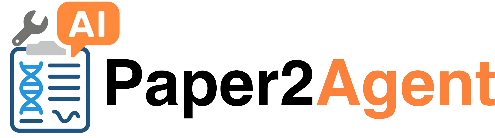

<p align="center">
  
</p>

<h3>Paper2Agent: Reimagining Papers As AI Agents, Using AI Agents</h3>
## Overview
`Paper2Agent` is a multi-agent AI system that automatically transforms research papers into interactive AI agents with minimal human input.

## Demos
Below, we showcase demos of AI agents created by Paper2Agent, illustrating how each agent applies the tools from its source paper to tackle scientific tasks.
### 🧬 AlphaGenome Agent for Genomic Data Interpretation
Example query:
```
Analyze heart gene expression data with AlphaGenome MCP to identify the causal gene
for the variant chr11:116837649:T>G, associated with Hypoalphalipoproteinemia.
```

https://github.com/user-attachments/assets/34aad25b-42b3-4feb-b418-db31066e7f7b

### 🗺️ TISSUE Agent for Uncertainty-Aware Spatial Transcriptomics Analysis
Example query:
```
Calculate the 95% prediction interval for the spatial gene expression prediction of gene Acta2 using TISSUE MCP.

This is my data:
Spatial count matrix: Spatial_count.txt
Spatial locations: Locations.txt
scRNA-seq count matrix: scRNA_count.txt
```

https://github.com/user-attachments/assets/2c8f6368-fa99-4e6e-b7b5-acc12f741655

### 🧫 Scanpy Agent for Single-Cell Data Preprocessing
Example query:
```
Use Scanpy MCP to preprocess and cluster the single-cell dataset pbmc_all.h5ad.
```

## 🤖 How to Create a Paper Agent?

To streamline usage, we recommend creating Paper Agents by connecting Paper MCP servers to an AI coding agent, such as [Claude Code](https://www.anthropic.com/claude-code) or the [Google Gemini CLI](https://google-gemini.github.io/gemini-cli/) (it's free with a Google account!).
We are also actively developing our own base agent, which will be released soon.

#### ⚙️ Using Claude Code
First, install and set up Claude Code:
```bash
npm install -g @anthropic-ai/claude-code
claude
```
After setup, link Claude Code with the Paper MCP server of interest.
For example, to create an AlphaGenome Agent, run:
```
claude mcp add \
--transport http \
alphagenome \
https://Paper2Agent-alphagenome-mcp.hf.space/mcp

claude
```
✅ You will now have an **AlphaGenome Agent** ready for genomics data interpretation.

## 🔗 Connectable Paper MCP Servers
* AlphaGenome: https://Paper2Agent-alphagenome-mcp.hf.space/mcp
* Scanpy: https://Paper2Agent-scanpy-mcp.hf.space/mcp
* TISSUE: https://Paper2Agent-tissue-mcp.hf.space/mcp

## Quick Start
The source code of `Paper2Agent` will be released soon.

## Citation
```
@misc{miao2025paper2agent,
      title={Paper2Agent: Reimagining Research Papers As Interactive and Reliable AI Agents}, 
      author={Jiacheng Miao and Joe R. Davis and Jonathan K. Pritchard and James Zou},
      year={2025},
      eprint={2509.06917},
      archivePrefix={arXiv},
      primaryClass={cs.AI},
      url={https://arxiv.org/abs/2509.06917}, 
}
```
